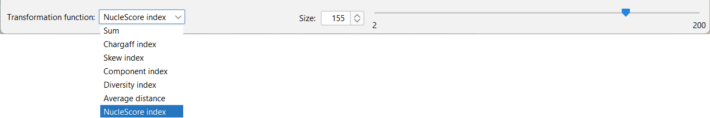

<!-- HEARDERS -->
<div>
  <h1 align="center">G2P Model<br />
  From Genome to Pixels Model</h1>

  <p align="center">
    <b>An approach to transform Genomes into 2-Dimensional Images</b>
    <br />
    <br />
    
  </p>
</div>


<!--------------------------------------------------------------------->
<h1 >Getting Started</h1>
The G2P tool allows to extract images from any fasta files, containing set of nucleotides (A, T, C ang G).
The model can exploit well-known indicators in the field, to create contrast and bring out the breaking points in the final image, and consequently in the genome.
<br />
The tool relies on three parameters:
<ul>
  <li><b>The genome (GN):</b><br />
    that correspond to the .fasta file containing the whole genome as a sequence of nucleobases (A, T, C ang G).
  </li>
  
  <li><b>The portion size (S):</b><br />
     the given size used to extract portions of the genome, used to encode each pixel.
  </li>
  
  <li><b>Transformation function (T):</b><br />
     that transforms each genome sub-sequence of size S it into an integer representing the color of a pixel.
  </li>
</ul>

By this way, the G2P Tool allows to extract several representations of a same genome according to the feature that want to be highlighted.

The application can be used in Graphical modes and in commande line interface (CLI).


<!--------------------------------------------------------------------->

<h1>Graphic interface</h1>
The graphical mode can be started by double-clicking on the file <b><i>G2P-Model.jar</i></b> or by using the commande
<br />
<br />
  
```sh
java -jar G2P-Model.jar
```

Note that in both case the directory <b><i>images</i></b> must be in the same directory than the <b><i>G2P-Model.jar</i></b> file.

Once the interface is started, a fasta file containing the genome must be loaded to begin. 
It can be loaded by using the <b><i>Menu</i></b> or the <b><i>Tool bar</i></b>.

<p align="center">
 &nbsp; &nbsp; &nbsp; &nbsp; &nbsp; &nbsp; &nbsp; &nbsp; 
</p>

Once the genome is loaded, a transformation function and a portion size can be chosen on the lower part of the window. The effects are directly visible on the resulting genome.

<p align="center">

</p>

Each pixel of the image is clickable and causes the display of the genome sub-sequence that has been used to encode it.
Thus, when an area of interest is identified on the image, it is then possible to know precisely the composition of the sequence concerned.

Finally, the generated images can be saved in $png$ files and can be opened by any image reader.


<!--------------------------------------------------------------------->

<h1>Command line interface</h1>

In commande line, the tool can be used as follow 

```sh
java -jar G2P-Model.jar <genome> <transformationFunction> <portionSize> <resultingImage>
```

<ul>
  <li><b>genome:</b><br />
    that correspond to the <b><i>.fasta file</b></i> containing the whole genome as a sequence of nucleobases (A, T, C ang G).
  </li>
  
  <li><b>transformationFunction:</b><br />
     the transformation function used (between: sum, chaffgard, skew, component, diversity, distance, nuclescore)
  </li>
  
  <li><b>portionSize:</b><br />
     the size of the subsequence used to encode each pixel (between: 1 and 100 000).
  </li>

  <li><b>resultingImage:</b><br />
     name of the resulting <b><i>.png image</i></b> file.
  </li>
</ul>

Note that the resulting image is created, as a <b><i>.png</b></i> file, in the same reporty than the genome file.


<!--------------------------------------------------------------------->

<h1>Transformation functions implemented</h1>
In the current version of the application, several transformation functions have been implemented and can be used to extract images highlighting various kinds of features.
<ul>
  <li> <b><i>[1] Chargaff index:</b></i><br />
    provide the fraction of nucleic bases $G$ and $C$ of the sequence. The use with the $G2P$ model, aims to generate images highlighting the regions where this rate is maximiezd or minimzied.
  </li>
  
  <li> <b><i>[2] Skew index:</b></i><br />
    measures the asymmetry of the distribution of nucleobases in a sequence. The use with the $G2P$ model aims to produce images of the whole genome where the asymmetry is the most extreme.
  </li>
  
  <li> <b><i>[3] Component index:</b></i><br />
    evaluates the distribution of the bases in a sequence by comparing the number of each base $A$ and $T$ to the expected frequency of that bases in a balanced distribution. Images produces by this way highlight the regions where the imbalance is the strongest.
  </li>
  
  <li> <b><i>[4] Diversity index:</b></i><br />
    measures the diversity of bases in a sequence by comparing the number of different subsequences of given size to the expected frequency of those subsequences in a balanced distribution. In our experiments, we use this measure with subsequences of size 3. 
  </li>
</ul>


<!--------------------------------------------------------------------->

<h1>Contact</h1>

Erick Stattner - [@ErickStattner](https://twitter.com/ErickStattner) - erick.stattner[AT]univ-antilles.fr

Project Link: [https://github.com/estattner/G2P-Model](https://github.com/estattner/G2P-Model)


<!--------------------------------------------------------------------->
<h1>References</h1>

<ol>
  <li>Thomas A Clarke and Laurence D Hurst. Gc-content evolution in prokaryotes and eukaryotes: a tale of two genomes. Trends in genetics, 22(11):632–640, 2006
  </li>
  
  <li> Kazuharu Arakawa and Masaru Tomita. The gc skew index: a measure of genomic compositional asymmetry and the degree of replicational selection. Evolutionary Bioinformatics, 3:117693430700300006, 2007
  </li>
  
  <li> Jan Mrazek and Samuel Karlin. Strand compositional asymmetry in bacterial and large viral genomes. Proceedings of the National Academy of Sciences, 95(7):3720–3725, 1998
  </li>
  
  <li>
    José Manuel Peregr ́ın-  ́Alvarez and John Parkinson. The global landscape of sequence diversity. Genome biology, 8(11):1–17, 2007
   </li>
</ol>
